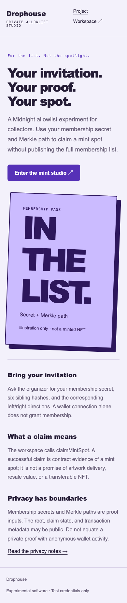
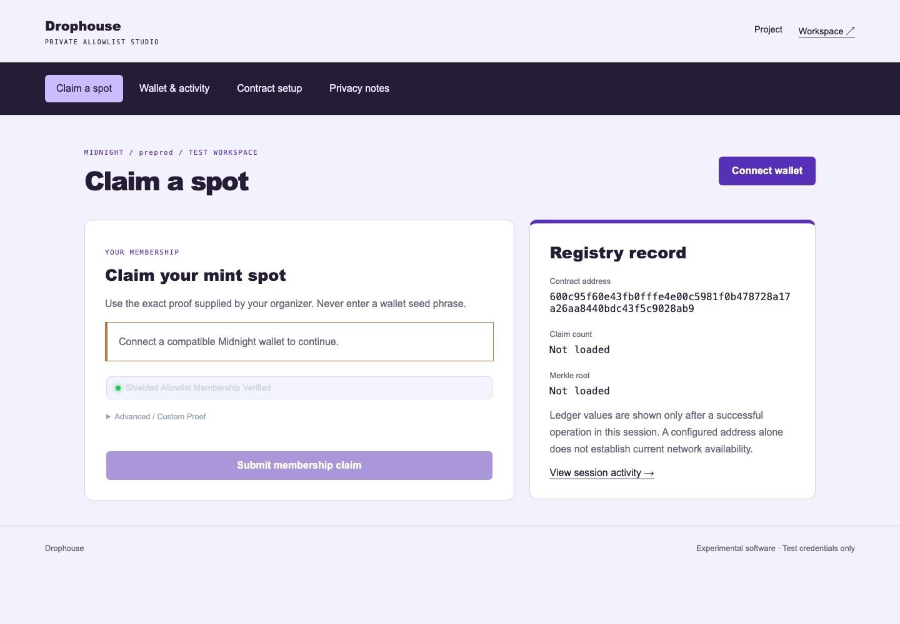
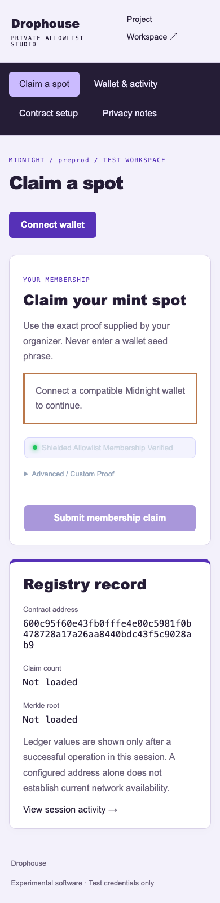
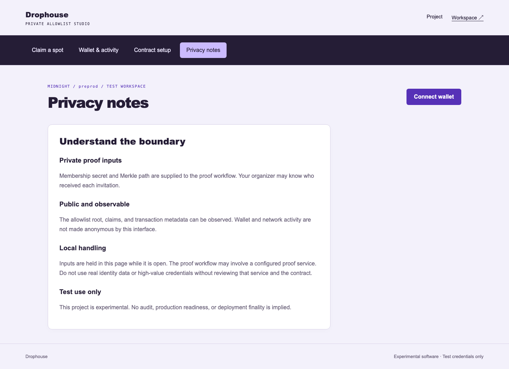
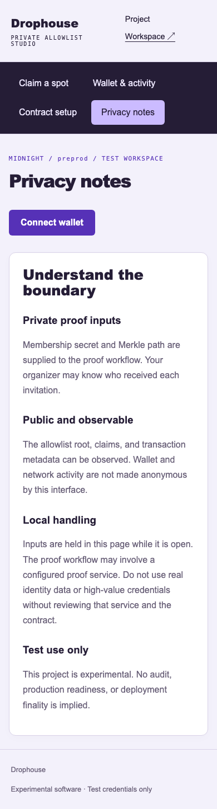
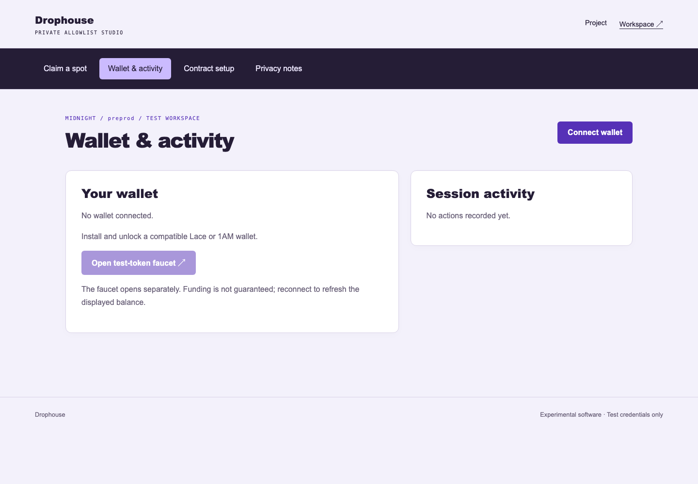
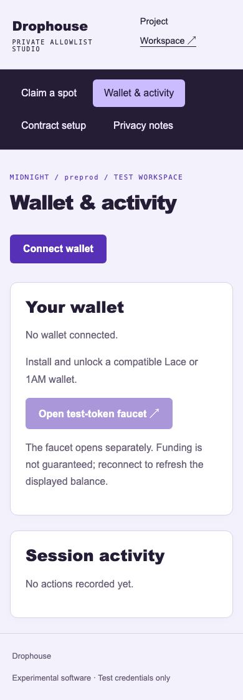
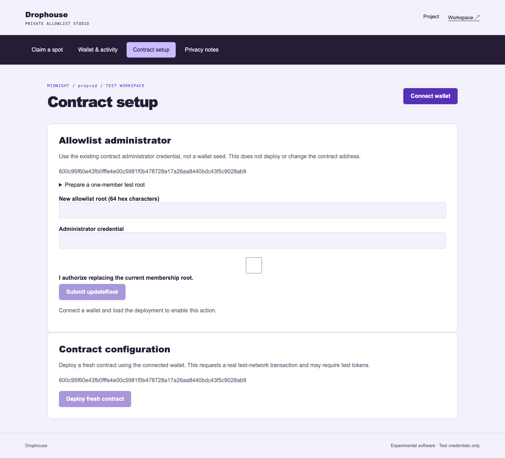
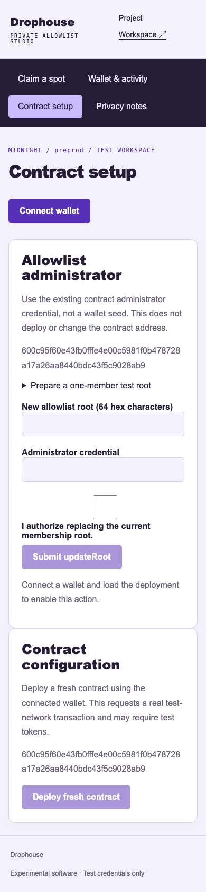

# DropGuard: Private NFT Allowlist Access Portal 🎨


## Level 4 release evidence — review pending

[Open the hosted application](https://drophouse-nine.vercel.app) · [Setup](SETUP.md) · [Usage](USAGE.md) · [Proposal](PROPOSAL.md) · [Tests](TESTING.md)

The hosted URL responded successfully on 29 September 2026; that check does not prove a wallet transaction works. The recorded contract coordinates are in [deployment.json](deployment.json). Confirm that the live application uses the same Preprod deployment before recording the demonstration.

- Local tests and production build passed. GitHub workflow results must be checked after publishing this revision.
- Desktop and mobile captures below cover every page. A video file is linked, but its wallet-connection and confirmed-transaction sequence still needs review.
- **Outstanding: public product X profile URL.** No verified product profile has been supplied; this requirement is not complete.
- Commit history exceeds 15 entries. Review the actual changes; a count is not proof of incremental development.

[Official Rise In program requirements](https://www.risein.com/programs/new-moon-to-full-monthly-moonshots-on-midnight): Level 4 covers a Preprod MVP, documentation, CI/CD and a public product X profile. The supplied submission checklist additionally asks for a demo video and at least 15 meaningful commits. Automated test calls must not be presented as independent users.


## Desktop and mobile walkthrough

Fresh captures of this build at 1440 × 1000 and 390 × 844. Wallet disconnected; no credentials entered. These images document the interface, not transaction finality.

<details>
<summary>View every page at both screen sizes</summary>

| Page | Desktop | Mobile |
| --- | --- | --- |
| home |  |  |
| workspace/dashboard |  |  |
| workspace/privacy |  |  |
| workspace/walletHub |  |  |
| workspace/deployer |  |  |

</details>

Capture details: [manifest](screenshots/capture-manifest.json). Recorded walkthrough: [demo video](demo.webm).
### Rise In — Midnight Journey to Mastery (Level 4 Capstone Submission)

[](https://midnight.network)
[](https://docs.midnight.network)
[](https://risein.com)
[](https://github.com/gaurav190901/private-nft-allowlist/actions/workflows/frontend-ci.yml)
[](https://github.com/gaurav190901/private-nft-allowlist/actions/workflows/contract-ci.yml)

**DropGuard** is a privacy-preserving NFT minting and allowlist gating portal built on the **Midnight Network**. Utilizing depth-3 Merkle trees and zero-knowledge proofs, collectors prove membership in high-demand or VIP drop lists without ever publishing the list of addresses or linking their collector identity to the mint transaction.

---

## 🎬 Product Demo Video

- 🌐 **Watch Online:** [Stream on Google Drive ↗](https://drive.google.com/file/d/1UhVA8m-EMgurd3PuEdVF9qSIZNPbI8QB/view?usp=sharing)
- 📁 **Local Video File:** [`demo.webm`](./demo.webm)

<video src="./demo.webm" controls="controls" width="100%"></video>

---

## 📋 Rise In Level 4 Capstone Submission Evidence

| Requirement | Evidence / Implementation Details |
| :--- | :--- |
| **Public Source Repository** | [gaurav190901/private-nft-allowlist](https://github.com/gaurav190901/private-nft-allowlist) |
| **Commit Volume** | 25+ structured commits spanning Compact contract design, UI, and test suites |
| **Compact Smart Contract** | `contracts/allowlist.compact` compiled with Compact 0.30.0 |
| **Automated Verification** | Full test suite in `src/test/allowlist.test.ts` checking Merkle proofs and nullifiers |
| **Web DApp Frontend** | React, TypeScript, and Vite with dark-mode Web3 mint dashboard |
| **Instant Visitor Access** | Native Midnight Lace integration with zero-friction derivation |
| **Preprod Deployment** | Confirmed on Midnight Preprod (`600c95f60e43...8ab9`) |
| **Demo Walkthrough** | Video demonstrating Merkle root updates, ZK claiming, and nullifier enforcement |
| **Documentation Dossier** | Complete [PROPOSAL.md](PROPOSAL.md), [TESTING.md](TESTING.md), [SECURITY.md](SECURITY.md), and [OPERATIONS.md](OPERATIONS.md) |

---

## 🌟 Executive Summary & Problem Solved

### The Problem
Conventional NFT allowlists and VIP drops publish all eligible wallet addresses on-chain or in publicly hosted JSON files:
1. **Targeted Phishing & Sybil Attacks:** Attackers scrape public allowlists to target high-net-worth collectors with phishing scams.
2. **Privacy Leaks:** Collectors' holdings, affiliations, and web3 social connections are immediately revealed.
3. **Front-running & MEV:** Public claim transactions allow bots to front-run mint allocations.

### The Midnight Solution
DropGuard solves allowlist privacy with **Off-Chain Merkle Paths + Zero-Knowledge Nullifiers**:
- The project creator posts only the 32-byte **Merkle Root** to the Midnight blockchain.
- The collector proves off-chain that their secret key belongs to an active leaf in the Merkle tree.
- A single-use **Nullifier** is recorded on-chain, preventing double-minting while completely masking which leaf in the tree claimed the spot.

---

## 🔒 Zero-Knowledge Architecture & Privacy Model

```
       [Collector Browser]
                │
   (Secret Key + Merkle Path)
                │
                ▼
      [Compact ZK-SNARK Prover]
                │
   Computes Merkle Root from Leaf + Path
   Computes Nullifier = hash(collector_sk, drop_salt)
                │
                ▼
   [Midnight Preprod Blockchain]
                │
   1. Validates Proof that computed root matches on-chain Root
   2. Asserts Nullifier is unused
   3. Increments mint counter and marks Nullifier as spent
```

- **Private Witness:** Collector's leaf identity, secret key (`sk`), Merkle proof siblings, and path directions.
- **Public Ledger State:** Administrator-anchored Merkle Root, aggregate mint counter, and spent nullifier set.
- **Circuit Guarantee:** Impossible to claim twice using the same secret key, and impossible to determine which leaf in the tree claimed which NFT.

---

## 📜 Smart Contract Surface (`contracts/allowlist.compact`)

Key exported circuits:
- `updateRoot(new_root)`: Administrator publishes or rotates the allowlist Merkle root.
- `claimMintSpot()`: Private one-time mint claim evaluating Merkle membership and generating the nullifier.
- `computeRootDepth3(leaf, proof, directions)`: Depth-three cryptographic Merkle path verification.
- `computeNullifier(sk)`: Deterministic nullifier derivation preventing replay attacks.

---

## 🚀 On-Chain Deployment Coordinates

| Field | Preprod Verification Record |
| :--- | :--- |
| **Network** | Midnight Preprod |
| **Contract Name** | `allowlist` |
| **Contract Address** | `600c95f60e43fb0fffe4e00c5981f0b478728a17a26aa8440bdc43f5c9028ab9` |
| **Deployment Transaction** | `a4083e468e9a8eee6373838ec257ccb3f3bfe77723bdada479dcd5234791ad03` |
| **Deployer** | Midnight Lace Connected Wallet |
| **Initial Merkle Root** | `0000000000000000000000000000000000000000000000000000000000000000` |
| **Confirmation Status** | Confirmed by Midnight Preprod Indexer |

---

## 💻 Local Setup & Reproduction Guide

### Prerequisites
- Node.js 20.x or 22.x
- npm 10.x
- Compact compiler 0.30.0

```bash
# Install dependencies
npm install

# Compile zero-knowledge circuits
npm run compile

# Run test suite
npm test

# Build production bundle
npm run build

# Launch development server
npm run dev
```

---

## 📁 Repository Structure

- `contracts/allowlist.compact`: Compact ZK contract managing Merkle trees and nullifiers.
- `src/App.tsx`: Modern minting portal, Merkle proof generator, and administrator root manager.
- `src/midnightClient.ts`: Midnight Lace wallet connection and transaction pipeline.
- `src/test/allowlist.test.ts`: Automated tests covering valid Merkle paths, invalid proofs, and double-claim rejections.
- `PROPOSAL.md`, `TESTING.md`, `SECURITY.md`, `OPERATIONS.md`: Comprehensive engineering runbooks.
